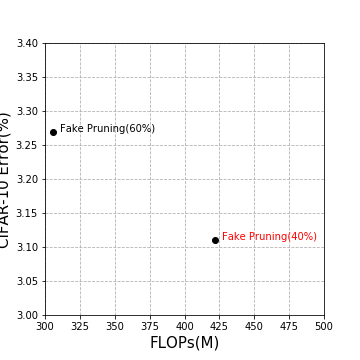

# Tools list

[TOC]

## Python 

### 重加载模型

```python
# Python 3.4+ only.
from importlib import reload  

# Condition 1: foo is a folder, ./foo/utils.py, reload utils.py
reload(foo.utils)
from foo.utils import *

# Condition 2: foo.py is a script, reload foo.py
reload(foo)
```

### Pytorch 多进程

```python
import torch.multiprocessing as mp

processes = []
params_list = [['mts_archive', 'ArabicDigits', 'fcn', 'adam'],
               ['mts_archive', 'AUSLAN', 'fcn', 'adam'],
               ['mts_archive', 'CharacterTrajectories', 'fcn', 'adam']]
num_processes = len(params_list)

for i in range(num_processes):
    p = mp.Process(target=main, args=(params_list[i]))
    p.start()
    processes.append(p)

for p in processes:
    p.join()
```

## [深拷贝与浅拷贝](https://www.cnblogs.com/richardzhu/p/4723750.html)

Python中的对象之间赋值时是按引用传递的，如果需要拷贝对象，需要使用标准库中的 `copy` 模块。

1. `copy.copy ` 浅拷贝 只拷贝父对象，不会拷贝对象的内部的子对象。

2. `copy.deepcopy` 深拷贝 拷贝对象及其子对象

   ```python
   >>> import copy
   >>> a = [1,2,3,4,['a','b']]  #原始对象
   
   >>> b = a  #赋值，传对象的引用
   >>> c = copy.copy(a)
   >>> d = copy.deepcopy(a)
   >>> a.append(5)
   >>> a[4].append('c')
   
   >>> print 'a=',a
   a= [1, 2, 3, 4, ['a', 'b', 'c'], 5]
   >>> print 'b=',b
   b= [1, 2, 3, 4, ['a', 'b', 'c'], 5]
   >>> print 'c=',c
   c= [1, 2, 3, 4, ['a', 'b', 'c']]
   >>> print 'd=',d
   d= [1, 2, 3, 4, ['a', 'b']]
   ```

   

## Deep Learning (Pytorch)

### ModuleList 和 Sequential 的区别

[PyTorch 中的 ModuleList 和 Sequential: 区别和使用场景](https://zhuanlan.zhihu.com/p/64990232)


### 参数统计

```python
# The model is defined before, the codes below counts the number of parameters in training model
num_parameters_train = sum(p.numel() for p in model.parameters() if p.requires_grad)
```


### 让模型使用多块GPU

```python
# Pytorch will only use one GPU by default. You can easily run your operations on multiple GPUs 
# by making your model run parallelly using `DataParallel`
model = nn.DataParallel(model)
```


### TensorboardX guidance

```python
# import module 
from tensorboardX import SummaryWriter

# define logger
logger = SummaryWriter(dir_logs)

# write variable to tensorboard
logger.add_scalars('{}/loss'.format(log_model_name), \
                   {'loss': loss_epoch.item()}, epoch)
```

```bash
# view logs across browser
tensorboard --logdir ./ [--port 6007]
```


### pytorch 框架下 CNN 计算量（Flops），不适用RNN

#### Install the latest version

```bash
pip install --upgrade git+https://github.com/sovrasov/flops-counter.pytorch.git
```

#### Example

```python
import torch
import torchvision.models as models
from ptflops import get_model_complexity_info

with torch.cuda.device(0):
  net = models.densenet161()
  flops, params = get_model_complexity_info(net, (3, 224, 224), as_strings=True, print_per_layer_stat=True)
  print('Flops:  ' + flops)
  print('Params: ' + params)
```


## Markdown

### 折叠单元

```markdown
# A collapsible section with markdown (work in github)
<details>
  <summary>Click to expand!</summary>
  <p>
  ## Heading
  1. A numbered
  2. list
     * With some
     * Sub bullets
  </p>
</details>
```

-   效果展示


## Latex

### 字符间空格不同大小

| 空格类型     | 写法       | 效果演示     | 效果描述       |
| ------------ | ---------- | ------------------------------------------------------------ | -------------- |
| 两个quad空格 | a \qquad b | $a \qquad b$ | 两个*m*的宽度  |
| quad空格     | a \quad b  | $a \quad b$ | 一个*m*的宽度  |
| 大空格       | a\ b       | $a\ b$ | 1/3*m*宽度     |
| 中等空格     | a\;b       | $a\;b$ | 2/7*m*宽度     |
| 小空格       | a\,b       | $a\,b$ | 1/6*m*宽度     |
| 没有空格     | ab         | $ab\,$ |                |
| 紧贴         | a\!b       | $a\!b$ | 缩进1/6*m*宽度 |


### 使公式间距相等，避免因分式和非分式造成间距差

-   Key words:

    **\vphantom{\frac11}**

-   Equal vertical space

```latex
\begin{align}
f_1(x) &= \frac{15x}{3} \\
f_2(x) &= \vphantom{\frac11} 3x + 5 \\
f_3(x) &= \vphantom{\frac11} 4x + 13
\end{align}
```

$$
\begin{align}
f_1(x) &= \frac{15x}{3} \\
f_2(x) &= \vphantom{\frac11}3x + 5 \\
f_3(x) &= \vphantom{\frac11}4x + 13
\end{align}
$$

-   Unequal vertical space

```latex
\begin{align}
f_1(x) &= \frac{15x}{3} \\
f_2(x) &= 3x + 5 \\
f_3(x) &= 4x + 13
\end{align}
```

$$
\begin{align}
f_1(x) &= \frac{15x}{3} \\
f_2(x) &= 3x + 5 \\
f_3(x) &= 4x + 13
\end{align}
$$


## Matplotlib

### 画散点图

```python
# data:
# [['306', '3.27', 'Fake Pruning(60%)'],
#  ['422', '3.11', 'Fake Pruning(40%)']]
x = [float(i) for i in data[:,0]]
y = [float(i) for i in data[:,1]]
label = data[:,2]

fig, ax = plt.subplots(figsize=(5,5))
# different color of two part of points
ax.scatter(x[:9], y[:9], c='black', marker='o')
ax.scatter(x[9:], y[9:], c='red', marker='x')
ax.set_xlim(300, 450)
ax.set_ylim(3, 3.4)
# set interval of coordinate axis
ax.xaxis.set_major_locator(MultipleLocator(1))
ax.yaxis.set_major_locator(MultipleLocator(100))
ax.set_xlabel('FLOPs(M)', fontsize=15)
ax.set_ylabel('CIFAR-10 Error(%)', fontsize=15)
# set grid's shape
plt.grid(ls='--')
for i, txt in enumerate(label):
    if i < 1:
        ax.annotate(txt, (x[i]+5,y[i]), fontsize=10)
    else:
        ax.annotate(txt, (x[i]+5,y[i]), color='r', fontsize=10)
plt.show()
plt.savefig('./result.png')
# save the figure to pdf file
plt.savefig('result.pdf', format='pdf')
```

-   效果展示

    
    
    ### 画图常用参数
    
    #### 线条风格(linestyle)
    
    | 线条风格 | 实线 | 虚线 | 破折线 | 点画线 | 无线条    |
    | -------- | ---- | ---- | ------ | ------ | --------- |
    | 代码表示 | -    | :    | –      | -.     | None 或 , |
    
    #### 线条颜色(color)
    
    | 线条颜色 | 红   | 洋红 | 黄   | 绿   | 青   | 蓝   | 黑   | 白   |
    | -------- | ---- | ---- | ---- | ---- | ---- | ---- | ---- | ---- |
    | 代码表示 | r    | m    | y    | g    | c    | b    | k    | w    |
    
    #### 线条标记(marker)
    
    | 标记 |   描述   |  标记   |   描述   | 标记 |   描述   |
    | :--: | :------: | :-----: | :------: | :--: | :------: |
    |  o   |   圆圈   |    .    |    点    |  *   |   星号   |
    |  +   |   加号   |    v    | 朝下三角 |  ^   | 朝上三角 |
    |  <   | 朝左三角 |    >    | 朝右三角 |  D   |  大菱形  |
    |  d   |  小菱形  |    s    |  正方形  |  p   |  五边形  |
    |  H   | 大六边形 |    h    | 小六边形 |  p   |  八边形  |
    |  x   |   ✘号    | None或, |  无标记  |      |          |
    
    #### 参考博客：
    
    -    [https://blog.csdn.net/guoziqing506/article/details/78975150](https://blog.csdn.net/guoziqing506/article/details/78975150)
    -   博客包含以下内容：
        -   绘制一个最简单的折线图
        -   绘制不同风格的线条
        -   坐标轴的控制
        -   坐标范围
        -   坐标标题
        -   坐标间隔设定
        -   多图叠加
            -   多曲线
            -   多图与多子图
        -   标题和图例
            -   图像标题
            -   图例
        -   网格，背景色以及文字注释
            -   添加网格
            -   背景色
            -   文字注释


