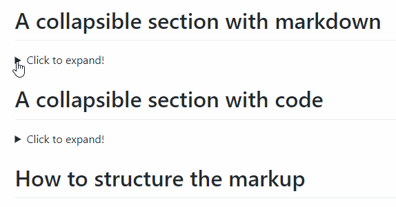

# Tools list

[TOC]

## Python 

### 重加载模型

```python
# Python 3.4+ only.
from importlib import reload  

# Condition 1: foo is a folder, ./foo/utils.py, reload utils.py
reload(foo.utils)
from foo.utils import *

# Condition 2: foo.py is a script, reload foo.py
reload(foo)

# Condition 3: foo.py is a script, Foo is a class in foo.py, reload Foo
relaod(foo)
from foo import Foo
```


### [深拷贝与浅拷贝](https://www.cnblogs.com/richardzhu/p/4723750.html)

Python中的对象之间赋值时是按引用传递的，如果需要拷贝对象，需要使用标准库中的 `copy` 模块。

1. `copy.copy ` 浅拷贝 只拷贝父对象，不会拷贝对象的内部的子对象。

2. `copy.deepcopy` 深拷贝 拷贝对象及其子对象

   ```python
   >>> import copy
   >>> a = [1,2,3,4,['a','b']]  #原始对象
   
   >>> b = a  #赋值，传对象的引用
   >>> c = copy.copy(a)
   >>> d = copy.deepcopy(a)
   >>> a.append(5)
   >>> a[4].append('c')
   
   >>> print 'a=',a
   a= [1, 2, 3, 4, ['a', 'b', 'c'], 5]
   >>> print 'b=',b
   b= [1, 2, 3, 4, ['a', 'b', 'c'], 5]
   >>> print 'c=',c
   c= [1, 2, 3, 4, ['a', 'b', 'c']]
   >>> print 'd=',d
   d= [1, 2, 3, 4, ['a', 'b']]
   ```


### for 和 if else 同一行使用方法

- `for` 和 `if` 同一行时，`if` 放在 `for` **后面**

  ```python
  mask_ = [[1 for j in range(6) if i<j] for i in range(6)]
  
  >>> mask_
  [[1, 1, 1, 1, 1], [1, 1, 1, 1], [1, 1, 1], [1, 1], [1], []]
  ```

- `for` 和 `if else` 同一行时，`if else` 放在 `for` **前面**

  ```python
  mask_ = [[1 if i<j  else 0 for j in range(6)] for i in range(6)]
  
  >>> mask_
  [[0, 1, 1, 1, 1, 1],
   [0, 0, 1, 1, 1, 1],
   [0, 0, 0, 1, 1, 1],
   [0, 0, 0, 0, 1, 1],
   [0, 0, 0, 0, 0, 1],
   [0, 0, 0, 0, 0, 0]]
  ```


### from IPython import embed 遇到的坑

torch.multiprocessing 和 from IPython import embed 不要同时用，会有 bug


## Tensorflow

### 参数统计

```python
import operator
def num_params():
        """ Return total num of params of the model  """
        total_num = 0
        for var in tf.trainable_variables():
            shape = var.get_shape()
            total_num += functools.reduce(operator.mul, [dim.value for dim in shape], 1)
        return total_num
```


### 学习率衰减

```python
class PlateauLRDecay:
    """ Adjust learning rate.
    Args:
    	init_lr: float, initial learning rate.
    	epoch_patience: int, the epoch interval to reduce lr.
    	period_patience: int, the upper-bound number of epoch_patience.
    	min_lr: float, the minimum learning rate.
    	rate: float, reduce rate.
    	verbose: bool, if display learning rate on shell or not.
    """
    def __init__(self, init_lr, epoch_patience, period_patience, min_lr=0.00001, rate=0.4, verbose=False):
        self.lr = init_lr
        self.epoch_patience = epoch_patience
        self.period_patience = period_patience
        self.min_lr = min_lr
        self.rate = rate
        self.verbose = verbose

        self.prev_best_epoch_num = 0
        self.prev_best_loss = float('inf')

        if self.lr <= self.min_lr:
            self.lr = self.min_lr
            self.is_min_lr = True
        else:
            self.is_min_lr = False

    def update_lr(self, loss, epoch_num):
        """ Update learning rate.
        Args:
        	loss: float, loss of every epoch.
        	epoch_num: int, epoch.
        Return:
        	bool, if update or not.
        """
        if loss < self.prev_best_loss:
            self.prev_best_loss = loss
            self.prev_best_epoch_num = epoch_num
        else:
            epochs = epoch_num - self.prev_best_epoch_num
            if self.is_min_lr is True or epochs >= self.epoch_patience * self.period_patience:
                self.lr = 0.0
            elif epochs % self.epoch_patience == 0:
                # reduce lr
                self.lr = min(self.lr * self.rate, self.min_lr)
                if self.is_min_lr is False and self.lr == self.min_lr:
                    self.is_min_lr = True
                    self.prev_best_epoch_num = epoch_num
                if self.verbose:
                    print('Reduce lr to ', self.lr)
                return True

        return False
```


### summary_writer

```python
def init_summary_writer(self, root_dir):
    """ Init tensorboard writer  """
    tf_board_dir = 'tfb_dir'
    folder = os.path.join(root_dir, tf_board_dir)
    self.train_summary_writer = tf.summary.FileWriter(os.path.join(folder, 'train'), self.sess.graph)
    self.valid_summary_writer = tf.summary.FileWriter(os.path.join(folder, 'valid'))
    self.test_summary_writer = tf.summary.FileWriter(os.path.join(folder, 'test'))

def write_summary(self, epoch_num, kv_pairs, phase):
    """ Write summary into tensorboard """
    if phase == RunnerPhase.TRAIN:
        summary_writer = self.train_summary_writer
    elif phase == RunnerPhase.VALIDATE:
        summary_writer = self.valid_summary_writer
    elif phase == RunnerPhase.PREDICT:
        summary_writer = self.test_summary_writer
    else:
        raise RuntimeError('Unknow phase: ' + phase)

    if summary_writer is None:
        return

    for key, value in kv_pairs.items():
        metrics = tf.Summary()
        metrics.value.add(tag=key, simple_value=value)
        summary_writer.add_summary(metrics, epoch_num)

    summary_writer.flush()
```


### APIs

#### tf.scan

[http://wuxiaoqian.blogspot.com/2017/07/tfscan.html](http://wuxiaoqian.blogspot.com/2017/07/tfscan.html)

```python
def dynamic_run(self, seq_type_emb, dtime):
        def move_forward_fn(accumulator, item):
            pass
            return h_t, init_state

        initial_state = list()
        initial_h_t = list()

        h_ts, cell_states = tf.scan(move_forward_fn,
                                    elements,
                                    initializer=(initial_h_t, initial_state))

        return h_ts, cell_states
```


#### tf.gather_nd

[https://zhuanlan.zhihu.com/p/45673869](https://zhuanlan.zhihu.com/p/45673869)


#### tf.split vs. torch.tensor.split

- tf.split(input, num_split, dimension)

  dimension 的意思就是输入张量的哪一个维度，如果是 0 就表示对第 0 维度进行切割。num_split 就是切割的数量，如果是 2 就表示输入张量被切成 2 份，每一份是一个列表。

  ```python
  import tensorflow as tf;
  
  A = [[1,2,3],[4,5,6]]
  x = tf.split(A, 3, 1)
  
  with tf.Session() as sess:
      c = sess.run(x)
      for ele in c:
          print( ele )
  
  # Out:
  # [[1]
  #  [4]]
  # [[2]
  #  [5]]
  # [[3]
  #  [6]]
  ```

- torch.tensor.split(tensor,split_size_or_sections,dim=0)

  - 第一个参数是待分割张量
  - 第二个参数有两种形式。
    - 第一种是分割份数；
    - 第二种这是分割方案，这是一个list，待分割张量将会分割为len（list）份，每一份的大小取决于list中的元素
  - 第三个参数为分割维度

  ```python
  section=[1,2,1,2,2]
  d=torch.randint(0, 10, (8,4))
  print(torch.split(d,section,dim=0))
  #输出结果为：
  (tensor([[5, 8, 7, 9]]), tensor([[1, 4, 9, 3],
          [1, 3, 0, 4]]), tensor([[2, 4, 4, 2]]), tensor([[0, 3, 4, 8],
          [5, 7, 6, 3]]), tensor([[9, 2, 7, 1],
          [7, 5, 8, 8]]))
  ```

  

#### tf.cumsum

[https://blog.csdn.net/YiRanNingJing/article/details/79451786](https://blog.csdn.net/YiRanNingJing/article/details/79451786)

```python
tf.cumsum(
    x,
    axis=0,
    exclusive=False,
    reverse=False,
    name=None
)
```

函数 tf.cumsum 是 cumulative sum缩写，计算累积和，即沿着tensor（张量）x的某一个维度axis，计算累积和。

参数解释：

- x, 即我们要计算累积和的tensor。

- axis=0, 默认是沿着x的第0维计算累积和。

-  exclusive=False, 表示输出结果的第一元素是否与输入的第一个元素一致。默认exclusive=False，表示输出的第一个元素与输入的第一个元素一致（By default, this op performs an inclusive cumsum, which means that the first element of the input is identical to the first element of the output）。这是官方文档的解释。当我们对一个数组arr（或其他什么东东）进行累积求和时，我们要对累积和sum进行初始化，初始化的方式有两种，一种是将累积和初始化为0，即sum=0，一种是使用数组arr的第一个元素对累积和进行初始化，即sum=arr[0]。所以参数exclusive描述的是如何对累积和进行初始化。

-  reverse=False, 表示是否逆向累积求和。默认reverse=False，即正向累积求和。

```python
a = [[1 ,2, 3], 
     [4, 5, 6], 
     [7, 8, 9]]
# axis=0
sum1 = tf.cumsum(a, axis=0)
# sum1 = [[ 1,  2,  3],
#         [ 5,  7,  9],
#         [12, 15, 18]]

# exclusive=True
sum4 = tf.cumsum(a, exclusive=True)
# sum4= [[0, 0, 0],
#        [1, 2, 3],
#        [5, 7, 9]]# 

# reverse=True
sum5 = tf.cumsum(a, reverse=True)
# sum5 = [[12, 15, 18],
#         [11, 13, 15],
#         [ 7,  8,  9]]# 
```


## Pytorch

### ModuleList 和 Sequential 的区别

[PyTorch 中的 ModuleList 和 Sequential: 区别和使用场景](https://zhuanlan.zhihu.com/p/64990232)


### 参数统计

```python
# The model is defined before, the codes below counts the number of parameters in training model
num_parameters_train = sum(p.numel() for p in model.parameters() if p.requires_grad)
```


### Pytorch 多进程

```python
import torch.multiprocessing as mp

processes = []
params_list = [['mts_archive', 'ArabicDigits', 'fcn', 'adam'],
               ['mts_archive', 'AUSLAN', 'fcn', 'adam'],
               ['mts_archive', 'CharacterTrajectories', 'fcn', 'adam']]
num_processes = len(params_list)

for i in range(num_processes):
    p = mp.Process(target=main, args=(params_list[i]))
    p.start()
    processes.append(p)

for p in processes:
    p.join()
```


### 让模型使用多块GPU

```python
# Pytorch will only use one GPU by default. You can easily run your operations on multiple GPUs 
# by making your model run parallelly using `DataParallel`
model = nn.DataParallel(model)
```


### TensorboardX guidance

```python
# import module 
from tensorboardX import SummaryWriter

# define logger
logger = SummaryWriter(dir_logs)

# write variable to tensorboard
logger.add_scalars('{}/loss'.format(log_model_name), \
                   {'loss': loss_epoch.item()}, epoch)
```

```bash
# view logs across browser
tensorboard --logdir ./ [--port 6007]
```


### pytorch 框架下 CNN 计算量（Flops），不适用RNN

#### Install the latest version

```bash
pip install --upgrade git+https://github.com/sovrasov/flops-counter.pytorch.git
```

#### Example

```python
import torch
import torchvision.models as models
from ptflops import get_model_complexity_info

with torch.cuda.device(0):
  net = models.densenet161()
  flops, params = get_model_complexity_info(net, (3, 224, 224), as_strings=True, print_per_layer_stat=True)
  print('Flops:  ' + flops)
  print('Params: ' + params)
```


## Markdown

### 折叠单元

```markdown
# A collapsible section with markdown (work in github)
<details>
  <summary>Click to expand!</summary>
  <p>
  ## Heading
  1. A numbered
  2. list
     * With some
     * Sub bullets
  </p>
</details>
```

-   效果展示




## Latex

### 字符间空格不同大小

| 空格类型     | 写法       | 效果演示     | 效果描述       |
| ------------ | ---------- | ------------------------------------------------------------ | -------------- |
| 两个quad空格 | a \qquad b | $a \qquad b$ | 两个*m*的宽度  |
| quad空格     | a \quad b  | $a \quad b$ | 一个*m*的宽度  |
| 大空格       | a\ b       | $a\ b$ | 1/3*m*宽度     |
| 中等空格     | a\;b       | $a\;b$ | 2/7*m*宽度     |
| 小空格       | a\,b       | $a\,b$ | 1/6*m*宽度     |
| 没有空格     | ab         | $ab\,$ |                |
| 紧贴         | a\!b       | $a\!b$ | 缩进1/6*m*宽度 |


### 使公式间距相等，避免因分式和非分式造成间距差

-   Key words:

    **\vphantom{\frac11}**

-   Equal vertical space

```latex
\begin{align}
f_1(x) &= \frac{15x}{3} \\
f_2(x) &= \vphantom{\frac11} 3x + 5 \\
f_3(x) &= \vphantom{\frac11} 4x + 13
\end{align}
```

$$
\begin{align}
f_1(x) &= \frac{15x}{3} \\
f_2(x) &= \vphantom{\frac11}3x + 5 \\
f_3(x) &= \vphantom{\frac11}4x + 13
\end{align}
$$

-   Unequal vertical space

```latex
\begin{align}
f_1(x) &= \frac{15x}{3} \\
f_2(x) &= 3x + 5 \\
f_3(x) &= 4x + 13
\end{align}
```

$$
\begin{align}
f_1(x) &= \frac{15x}{3} \\
f_2(x) &= 3x + 5 \\
f_3(x) &= 4x + 13
\end{align}
$$


## Matplotlib

### 画散点图

```python
# data:
# [['306', '3.27', 'Fake Pruning(60%)'],
#  ['422', '3.11', 'Fake Pruning(40%)']]
x = [float(i) for i in data[:,0]]
y = [float(i) for i in data[:,1]]
label = data[:,2]

fig, ax = plt.subplots(figsize=(5,5))
# different color of two part of points
ax.scatter(x[:9], y[:9], c='black', marker='o')
ax.scatter(x[9:], y[9:], c='red', marker='x')
ax.set_xlim(300, 450)
ax.set_ylim(3, 3.4)
# set interval of coordinate axis
ax.xaxis.set_major_locator(MultipleLocator(1))
ax.yaxis.set_major_locator(MultipleLocator(100))
ax.set_xlabel('FLOPs(M)', fontsize=15)
ax.set_ylabel('CIFAR-10 Error(%)', fontsize=15)
# set grid's shape
plt.grid(ls='--')
for i, txt in enumerate(label):
    if i < 1:
        ax.annotate(txt, (x[i]+5,y[i]), fontsize=10)
    else:
        ax.annotate(txt, (x[i]+5,y[i]), color='r', fontsize=10)
plt.show()
plt.savefig('./result.png')
# save the figure to pdf file
plt.savefig('result.pdf', format='pdf')
```

-   效果展示

    
    
    ### 画图常用参数
    
    #### 线条风格(linestyle)
    
    | 线条风格 | 实线 | 虚线 | 破折线 | 点画线 | 无线条    |
    | -------- | ---- | ---- | ------ | ------ | --------- |
    | 代码表示 | -    | :    | –      | -.     | None 或 , |
    
    #### 线条颜色(color)
    
    | 线条颜色 | 红   | 洋红 | 黄   | 绿   | 青   | 蓝   | 黑   | 白   |
    | -------- | ---- | ---- | ---- | ---- | ---- | ---- | ---- | ---- |
    | 代码表示 | r    | m    | y    | g    | c    | b    | k    | w    |
    
    #### 线条标记(marker)
    
    | 标记 |   描述   |  标记   |   描述   | 标记 |   描述   |
    | :--: | :------: | :-----: | :------: | :--: | :------: |
    |  o   |   圆圈   |    .    |    点    |  *   |   星号   |
    |  +   |   加号   |    v    | 朝下三角 |  ^   | 朝上三角 |
    |  <   | 朝左三角 |    >    | 朝右三角 |  D   |  大菱形  |
    |  d   |  小菱形  |    s    |  正方形  |  p   |  五边形  |
    |  H   | 大六边形 |    h    | 小六边形 |  p   |  八边形  |
    |  x   |   ✘号    | None或, |  无标记  |      |          |
    
    #### 参考博客：
    
    -    [https://blog.csdn.net/guoziqing506/article/details/78975150](https://blog.csdn.net/guoziqing506/article/details/78975150)
    -   博客包含以下内容：
        -   绘制一个最简单的折线图
        -   绘制不同风格的线条
        -   坐标轴的控制
        -   坐标范围
        -   坐标标题
        -   坐标间隔设定
        -   多图叠加
            -   多曲线
            -   多图与多子图
        -   标题和图例
            -   图像标题
            -   图例
        -   网格，背景色以及文字注释
            -   添加网格
            -   背景色
            -   文字注释


